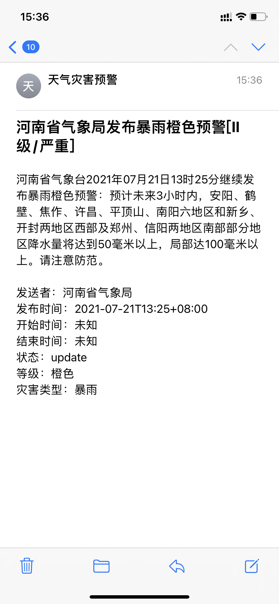
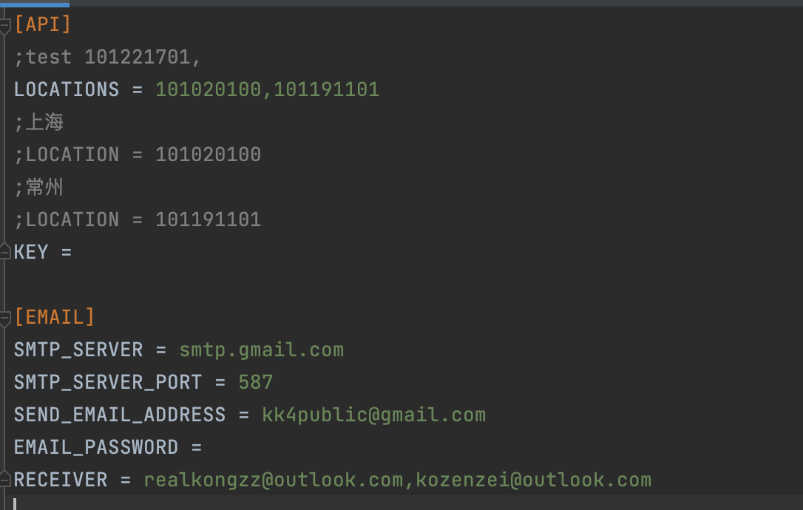

# 气象灾害预警

## 介绍

求人不如求己，为了防止我错过洪水预警还去坐地铁，我打算写个服务于我自己的气象灾害预警提醒小程序。

1. 每隔五分钟爬取指定城市的和风天气API

2. 假如有气象预警，向指定的邮箱发送邮件

   邮件demo⬇️

   

## 使用流程

1. 注册和风天气获取免费API，关于如何获取key，可参见官网https://dev.qweather.com/docs/start/get-key/

2. 下载项目

3. 安装包

   ```shell
   pip install schedule 
   pip insall requests
   ```

4. 配置config文件

   LOCATIONS：指定的城市的id，获取方式参见官网这个文档https://dev.qweather.com/docs/api/geo/city-lookup/，用`,`分隔。

   SMTP_SERVER: 是用来发送邮件，提供服务的邮箱的服务器地址，图中是gmail的smtp服务器，本项目基于smtp发送邮件。

   SMTP_SERVER_PORT: 是用来发送邮件，提供服务的邮箱的服务器端口号，587是smtp服务器的端口。

   SEND_EMAIL_ADDRESS：是用来发送邮件的邮箱地址。
   RECEIVER：接受邮件的地址，用`,`分隔。

   

5. 配置敏感信息，密码和api在系统配置文件中：

   打开~/.zshrc 或者~/.bashrc, 添加发送邮箱密码和api

   ```shell
   export EMAIL_PASS="password"
   export WEATHER_API="api_key"
   ```

   添加完成，保存，`source ~/.zshrc`激活

6. 进入文件路径，运行。

   ```shell
   python run.py
   ```

   